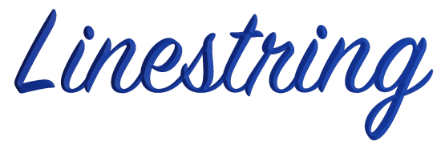

[](https://crates.io/crates/linestring)
[](https://docs.rs/linestring)
[](https://github.com/eadf/linestring.rs/workflows/Rust/badge.svg)
[](https://github.com/eadf/linestring.rs/workflows/Clippy/badge.svg)
[](https://deps.rs/crate/linestring/0.6.3)


# Line library for Rust

This crate contains data structures and methods that deals with lines in 2D and 3D space.

There are 3D and 2D implementations of:
* LineString, a sequence of points, aka Polyline.
* Line, a finite two-point struct (no rays).
* [Ramer–Douglas-Peucker](https://en.wikipedia.org/wiki/Ramer–Douglas–Peucker_algorithm) and
* [Visvalingam-Whyatt](https://en.wikipedia.org/wiki/Visvalingam–Whyatt_algorithm) line simplification algorithms.
* Sampling of [boostvoronoi](https://github.com/eadf/boostvoronoi.rs) parabolic arc curves.
* Rudimentary functionality to save to .obj file

There are 2D implementations of:
* LineString2 convex hull calculation (gift wrapping & Graham scan)
* Aabb [axis aligned bounding box](https://en.wikipedia.org/wiki/Minimum_bounding_box).
* Self intersection tests for line strings, or groups of lines O( n log n + i log n).
* Convex hull containment test (single threaded or multi-threaded with [ryon](https://crates.io/crates/rayon))
* Simple affine transformation (pan, zoom)

This is implemented for [cgmath](https://crates.io/crates/cgmath), 
[nalgebra](https://crates.io/crates/nalgebra), [vecmath](https://crates.io/crates/vecmath) 
and limited versions for [mint](https://crates.io/crates/mint) and plain vectors (no matrix transformations).
\
These implementations are feature gated, so you only have to include the 3d package you need in your code.
More implementations could be added if required.

If you want to use this library in your cgmath project you add this to your Cargo.toml:
```cargo
linestring = {version="0.6",default-features=false,features=["cgmath", "rayon"]}
```
Same thing for the other supported 2d/3d libraries: 
```cargo
linestring = {version="0.6",default-features=false,features=["nalgebra", "rayon"]}
```

```cargo
linestring = {version="0.6",default-features=false,features=["mint", "rayon"]}
```

```cargo
linestring = {version="0.6",default-features=false,features=["vecmath", "rayon"]}
```
```cargo
linestring = {version="0.6",default-features=false,features=["vector", "rayon"]}
```
The difference between ```vecmath``` and ```vector``` is that the ```vecmath``` feature supports 
matrix transformations.

## Rust toolchains

This crate uses `#![feature(map_first_last)]` if compiled by +nightly. This is functionality is only emulated when run on +stable.

## Demo GUI
Run the line simplification example with :
```fish
cargo run --example fltk_gui --no-default-features --features cgmath,rayon
```

## Todo
- [ ] Improve on error handling
- [ ] Benchmark and optimize (add smallvec to simplify rdp?)
- [ ] optimize Ramer–Douglas-Peucker
- [ ] optimize Visvalingam-Whyatt
- [ ] Stable overlapping co-linear line detection
- [ ] Add subdivide
